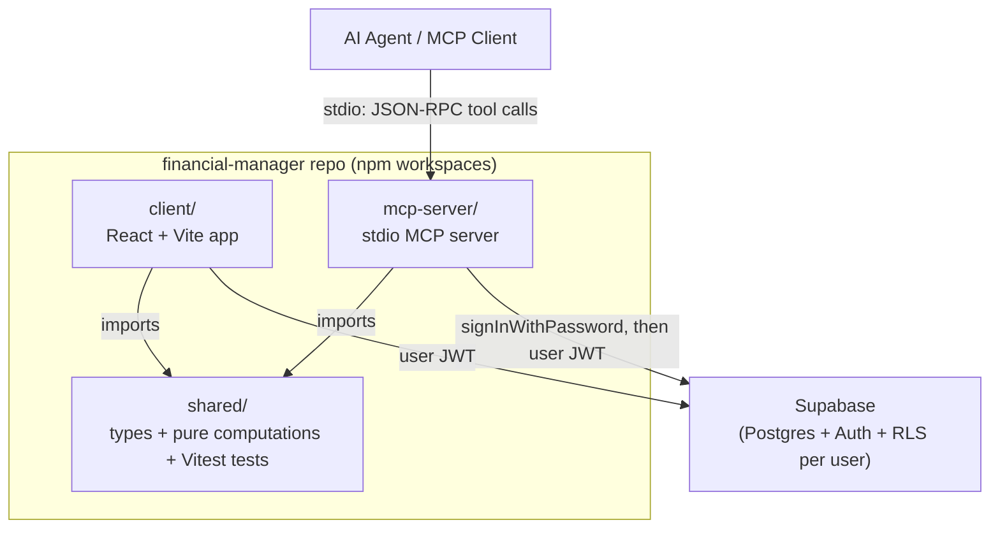
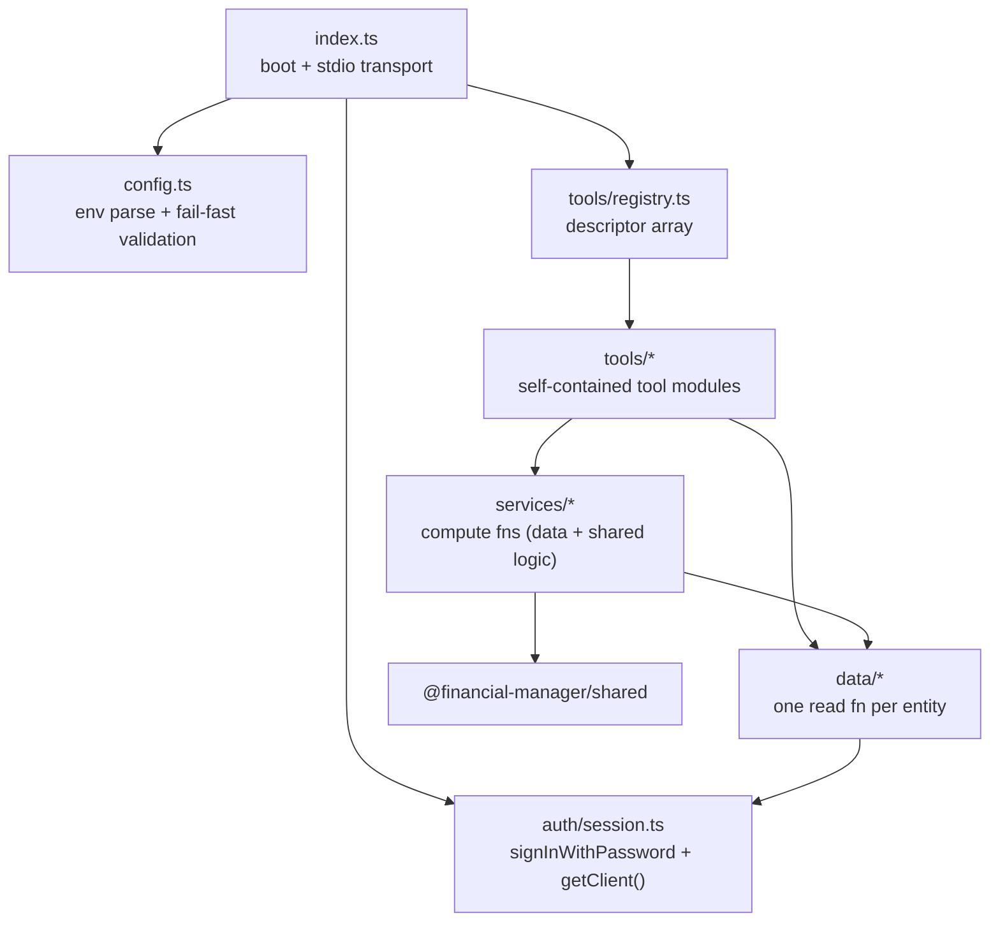
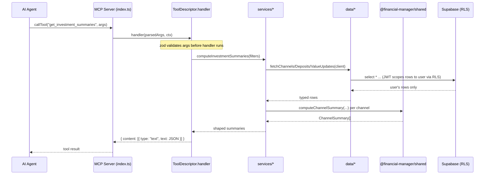
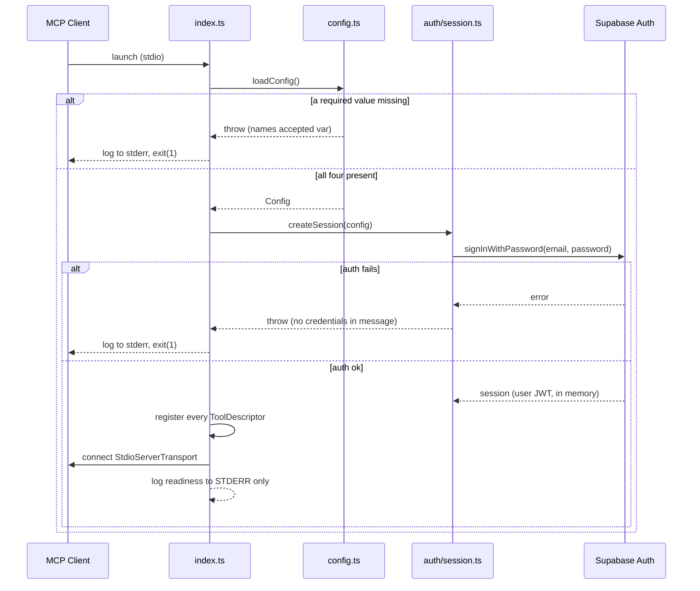

# Design Document: MCP Server for Financial Manager (Read-Only v1)

## Overview

This feature adds a local, stdio-based [Model Context Protocol](https://modelcontextprotocol.io) server that lets an AI agent query a single user's financial data (salaries, expenses, investments) from the existing Financial Manager Supabase backend. v1 is strictly **read-only**.

To avoid re-implementing business logic (investment event-sourcing summaries, expense inflation + payback-adjusted totals, salary aggregation), the project is restructured into an **npm workspaces monorepo** with three members:

- `shared/` — framework-agnostic TypeScript types + pure computation functions (no React, no Supabase client, no DOM). The single source of truth for business logic.
- `client/` — the existing React + Vite app, refactored to import types and computations from `shared/` with **zero behavior change**.
- `mcp-server/` — a Node/TypeScript stdio MCP server that authenticates as the user, fetches rows through a thin Supabase data-access layer, feeds them through `shared/` computations, and exposes everything through a modular tool registry.

Per-user data isolation is enforced **entirely by the existing Supabase Row Level Security (RLS) policies** (`auth.uid() = user_id` on every table, plus `check_fk_owner` FK-ownership triggers). The server authenticates with the anon key via `signInWithPassword`, holds the resulting user JWT in memory, and **never** uses or references the service-role key. The architecture is modular so future write tools (with an elicitation-based confirmation gate) drop in with no restructuring — v1 handler signatures already receive a server/elicitation-capable context.

This repo is **public**, so no production Supabase URL, anon key, or credentials are ever committed. All four config values come from the environment (optionally loaded from a git-ignored `mcp-server/.env`).

---

# Part 1 — High-Level Design

## Architecture



Key properties of this topology:

- `shared/` has no runtime dependency on React, the DOM, or `@supabase/supabase-js`. It is pure functions over plain data, so both the browser app and the Node server can call the identical code and get identical numbers.
- The MCP server is a leaf process launched on demand by the AI client over stdio. One process instance per user.
- Supabase is the only network dependency. RLS is the single enforcement point for data isolation — there is no server-side authorization code to get wrong.

## MCP Server internal layering



Layer responsibilities:

| Layer | Responsibility | Knows about |
| --- | --- | --- |
| `config.ts` | Read + validate the four env values (with aliases). Fail fast with per-variable messages. | env only |
| `auth/session.ts` | Create anon-key Supabase client, sign in, expose `getClient()`. Rely on supabase-js auto-refresh. | config |
| `data/*` | One function per entity: `fetch<Entity>(client, filters?)`. Returns `shared/` row types. No business logic. | session, shared types |
| `services/*` | Combine `data/` fetches with `shared/` computations to produce summaries/derived lists. | data, shared |
| `tools/*` | Each tool is a `ToolDescriptor` (`name`, `description`, `inputSchema` zod, `annotations`, `handler`). Handlers do filter parsing + shaping only. | services, data |
| `tools/registry.ts` | Array of all descriptors. `index.ts` iterates it to register each tool with the SDK. | tools |

## Request flow (tool call)



## Boot sequence



## Components and Interfaces

### Component: `shared/` package (`@financial-manager/shared`)

**Purpose**: Hold all portable types and pure business logic.

Barrel (`shared/src/index.ts`) re-exports:

```typescript
export * from './types'            // row-shape interfaces
export * from './dateUtils'        // formatLocalDate, todayStr, getEffectiveDate
export * from './investments'      // computeChannelSummary, ChannelSummary, CASH_PATH_LABEL,
                                    //   computeInvestmentTotals, computeReturnOverTime
export * from './expenses'         // inflateFixedExpense, computeAllExpenses, computeExpenseSummary
export * from './salary'           // aggregateSalariesByMonth, computeSalaryTotals
```

**Responsibilities**:
- Declare every row type once (moved out of client context `.tsx` files).
- Provide the investment event-sourcing engine, expense inflation + all-expenses/payback computation, and salary/investment aggregations as pure functions.
- Ship Vitest unit tests covering the regression-critical math.

### Component: MCP server config (`mcp-server/src/config.ts`)

**Purpose**: Resolve and validate the four required config values from the environment.

```typescript
interface Config {
  supabaseUrl: string
  supabaseAnonKey: string
  userEmail: string
  userPassword: string
}
```

**Responsibilities**:
- Load a git-ignored `mcp-server/.env` via dotenv (so values can live there for local dev; MCP client configs may also inject them as process env directly).
- Resolve email from `SUPABASE_USER_EMAIL` or alias `FINANCIAL_MANAGER_EMAIL`; password from `SUPABASE_USER_PASSWORD` or alias `FINANCIAL_MANAGER_PASSWORD`.
- Fail fast when any value is missing, naming the accepted variable name(s).
- Contain **no** hardcoded URL/anon-key/credential defaults.

### Component: Auth session (`mcp-server/src/auth/session.ts`)

**Purpose**: Own the authenticated Supabase client.

```typescript
interface Session {
  getClient(): SupabaseClient    // the authenticated, RLS-scoped client
}

function createSession(config: Config): Promise<Session>
```

**Responsibilities**:
- Create a Supabase client with the **anon key only**.
- Call `signInWithPassword` once on boot; keep the session in memory (no disk writes); rely on supabase-js auto token refresh.
- Never log credentials; log auth errors to stderr.

### Component: Data access (`mcp-server/src/data/*`)

**Purpose**: Thin, one-function-per-entity readers returning `shared/` row types. No business logic beyond translating structured filters into Supabase query clauses.

### Component: Services (`mcp-server/src/services/*`)

**Purpose**: Compose `data/` reads with `shared/` computations to produce summaries and derived lists (e.g. all-expenses list, investment summaries, return-over-time, salary summary).

### Component: Tool registry (`mcp-server/src/tools/*`)

**Purpose**: Expose each capability as a self-contained descriptor; a central array registers them all.

```typescript
interface ToolContext {
  client: SupabaseClient
  server: McpServer          // present now so future write tools can call elicitation
}

interface ToolDescriptor<I extends z.ZodTypeAny = z.ZodTypeAny> {
  name: string
  description: string
  inputSchema: I
  annotations: {
    readOnlyHint: boolean          // true for every v1 tool
    destructiveHint?: boolean      // future write tools only
  }
  handler: (args: z.infer<I>, ctx: ToolContext) => Promise<ToolResult>
}

type ToolResult = { content: Array<{ type: 'text'; text: string }>; isError?: boolean }
```

## Data Models

All row types move verbatim from the client context files into `shared/src/types.ts` (names unchanged, so existing client imports keep working after the contexts re-import from `shared`).

```typescript
interface Salary {
  id: string; user_id: string; month: string; employer: string
  bruto: number; neto: number; created_at: string
}

interface Expense {
  id: string; user_id: string; name: string; category: string
  amount: number; date: string; salary_id: string | null; created_at: string
}

interface FixedExpense {
  id: string; user_id: string; name: string; category: string; amount: number
  start_date: string; end_date: string | null; salary_employer: string | null; created_at: string
}

interface Payback {
  id: string; user_id: string; direction: 'by_me' | 'to_me'
  name: string | null; category: string | null; amount: number; date: string; person: string
  expense_id: string | null; fixed_expense_id: string | null; payback_id: string | null; created_at: string
}

interface InvestmentChannel {
  id: string; user_id: string; name: string; company: string
  investment_path: string; is_pension: boolean; created_at: string
}

interface InvestmentDeposit {
  id: string; user_id: string; channel_id: string; amount: number; date: string
  depositor: string; salary_id: string | null; is_withdrawal: boolean; created_at: string
}

interface InvestmentValueUpdate {
  id: string; user_id: string; channel_id: string; value: number; date: string; created_at: string
}

interface ExpenseType {
  id: string; user_id: string; type_name: string; categories: string[]; created_at: string
}

interface DropdownOption {
  id: string; user_id: string; category: string; value: string; created_at: string
}
```

**Validation / invariants** (already enforced by the DB; the server relies on them, it does not re-check):
- Every row carries `user_id`; RLS restricts `SELECT` to `auth.uid() = user_id`.
- Dates are ISO `YYYY-MM-DD` strings; months are stored as the first-of-month `YYYY-MM-DD`.
- `paybacks.direction` is exactly one of `by_me` / `to_me`.
- Exactly one of a `to_me` payback's `expense_id` / `fixed_expense_id` / `payback_id` is set.
- `investment_deposits.is_withdrawal = true` rows have `depositor = 'אני'` and `salary_id = null`.

## Tool catalog (v1 — all read-only)

| Tool | Service it calls | Filters (all optional) |
| --- | --- | --- |
| `list_salaries` | fetchSalaries | dateFrom, dateTo (on `month`), employer, limit |
| `get_salary_summary` | computeSalaryTotals + aggregateSalariesByMonth | dateFrom, dateTo, employer |
| `list_expenses` | fetchExpenses | dateFrom, dateTo, category, limit |
| `list_fixed_expenses` | fetchFixedExpenses | category, activeOn (date), limit |
| `list_paybacks` | fetchPaybacks | direction, person, dateFrom, dateTo, limit |
| `list_all_expenses` | computeAllExpenses | dateFrom, dateTo, category, limit |
| `get_expense_summary` | computeExpenseSummary | dateFrom, dateTo, category |
| `list_investment_channels` | fetchChannels | company, isPension, limit |
| `list_investment_deposits` | fetchDeposits | channelId, depositor, isWithdrawal, dateFrom, dateTo, limit |
| `list_investment_value_updates` | fetchValueUpdates | channelId, dateFrom, dateTo, limit |
| `get_investment_summaries` | computeInvestmentSummaries | channelId, isPension |
| `get_investment_return_over_time` | computeReturnOverTime | channelId, isPension, dateFrom, dateTo |
| `list_dropdown_options` | fetchDropdownOptions | category |

## Error Handling

| Scenario | Condition | Response | Recovery |
| --- | --- | --- | --- |
| Missing config | A required env var absent on boot | Throw naming the accepted variable name(s); log to stderr; `exit(1)` | User sets the env var / `.env` entry |
| Auth failure | `signInWithPassword` rejects | Log a credential-free error to stderr; `exit(1)` | User fixes credentials; no secrets printed |
| Invalid tool args | zod parse fails | Return `{ isError: true, content: [{ type:'text', text: <validation message> }] }` | Agent retries with corrected args |
| Supabase query error | Network / server error mid-session | Return `isError` tool result with a safe message; log detail to stderr | Agent retries; session stays alive |
| Token expiry | JWT near expiry | supabase-js auto-refresh; transparent | None needed |
| Empty result | No matching rows | Return a valid empty structure (`[]` / zeroed summary), not an error | Agent interprets as "no data" |

**stdout discipline**: stdout is reserved exclusively for the MCP JSON-RPC protocol. All logging goes to **stderr**. This is a hard rule — any stray stdout write corrupts the protocol stream.

## Testing Strategy

- **Framework**: Vitest, set up in `shared/` (standard for Vite/TS). The `mcp-server/` package reuses Vitest for config + service tests.
- **Unit (shared/)**: the regression gate for the extractions — `computeChannelSummary` (deposit/withdrawal/value-update checkpoint math, same-date ordering, cash-channel branch, empty case), `dateUtils` (timezone-safe formatting, effective date with/without salary link), `inflateFixedExpense` (month generation, day clamping, end-date limit), `computeAllExpenses` (payback reductions in all three directions, effective-date shifts, zero-amount filtering), salary monthly aggregation, investment totals + return-over-time at known sample dates.
- **Unit (mcp-server/)**: `config.ts` parsing with mocked env (all present; alias variables; each missing-variable error path) — **no real credentials in tests**; service-layer filter + shaping logic against mocked data-access; zod schema parsing of each tool's filter args.
- **Client regression gate**: `npm run build -w client` (`tsc -b && vite build`) must still succeed, and charts/tables must render identical numbers after each extraction.
- **Manual E2E**: connect an MCP client (or SDK inspector) over stdio; confirm tool outputs match the web UI for the same user and that data is scoped to that user.

## Security Considerations

- **Isolation via RLS only**: the server authenticates as the user and inherits `auth.uid() = user_id` scoping on every table plus the `check_fk_owner` FK-ownership triggers. There is deliberately **no** authorization logic in server code — a code comment documents this invariant at the data layer.
- **No service-role key, ever**: the server is constructed with the anon key only. The local `client/.env` may be read for local testing, but those exact credentials are never written into any tracked file.
- **Public-repo hygiene**: no production URL/anon key/credentials in tracked source. `mcp-server/.gitignore` ignores `.env`; a tracked `mcp-server/.env.example` documents variables with placeholders only.
- **In-memory secrets**: the session lives in memory; nothing is persisted to disk. Credentials never appear in logs or tool output.
- **Read-only surface**: every v1 tool sets `readOnlyHint: true` and performs only `SELECT`s.

## Performance Considerations

- Datasets are a single user's personal finance records (hundreds to low thousands of rows) — all computation is in-memory and cheap.
- Data-access functions apply server-side filters (date range, category, channel, limit) in the Supabase query where possible to reduce payload; `shared/` computations run on the returned subset.
- No caching layer in v1; each tool call fetches fresh (the server is short-lived and launched per session).

## Dependencies

- `@modelcontextprotocol/sdk` — MCP server + `StdioServerTransport`.
- `@supabase/supabase-js` — Supabase client (anon key).
- `zod` — tool input schemas.
- `dotenv` — load git-ignored local `.env`.
- `@financial-manager/shared` — workspace package (types + computations).
- `vitest` — tests (dev), primarily in `shared/`.

---

# Part 2 — Low-Level Design

This section specifies the extracted pure functions (ported verbatim from the client to preserve exact semantics — the behavioral-parity guarantee) and the MCP server's core patterns. All code is TypeScript.

## shared/src/dateUtils.ts

```typescript
/** Format a local Date as YYYY-MM-DD. Never use toISOString() (UTC shift bug). */
function formatLocalDate(d: Date): string

/** Today as YYYY-MM-DD in local time. */
function todayStr(): string

/**
 * Effective date for a salary-linked item: items deducted from a salary are
 * attributed to the salary's month. Returns salaryMonthMap[salaryId] when linked,
 * else the item's own date.
 */
function getEffectiveDate(
  itemDate: string,
  salaryId: string | null,
  salaryMonthMap: Map<string, string>,
): string
```

**Preconditions**: `itemDate` is a valid `YYYY-MM-DD`; `salaryMonthMap` maps salary id → month string.
**Postconditions**: returns a `YYYY-MM-DD` string; pure, no side effects.

## shared/src/investments.ts

### computeChannelSummary (ported verbatim from `computeChannelSummary.ts`)

```typescript
const CASH_PATH_LABEL = 'מזומן / עו"ש'

interface ChannelSummary {
  totalDeposits: number    // net invested capital (deposits - withdrawals)
  currentValue: number     // running balance after replaying all events
  lastUpdated: string | null
  returnAbsolute: number   // accumulated P&L from value-update checkpoints
  returnPercent: number    // returnAbsolute / totalDeposits
}

function computeChannelSummary(
  channelId: string,
  deposits: InvestmentDeposit[],
  valueUpdates: InvestmentValueUpdate[],
  isCash?: boolean,         // default false
): ChannelSummary
```

**Algorithm** (event-sourcing / checkpoint — must preserve exactly):

```pascal
ALGORITHM computeChannelSummary(channelId, deposits, valueUpdates, isCash)
BEGIN
  IF isCash THEN
    channelValues ← valueUpdates filtered to channelId, sorted ascending by date
    IF channelValues is empty THEN RETURN zeroed summary
    latest ← last(channelValues)
    // value IS the balance; deposits ignored; return always 0
    RETURN { totalDeposits: latest.value, currentValue: latest.value,
             lastUpdated: latest.date, returnAbsolute: 0, returnPercent: 0 }
  END IF

  events ← []
  FOR each d IN deposits WHERE d.channel_id = channelId DO
    IF d.is_withdrawal THEN events.push(withdrawal(d.date, d.amount))
    ELSE events.push(deposit(d.date, d.amount))
  END FOR
  FOR each v IN valueUpdates WHERE v.channel_id = channelId DO
    events.push(value_update(v.date, v.value))
  END FOR
  IF events is empty THEN RETURN zeroed summary

  // Sort by date asc; on SAME date, deposits/withdrawals (order 0) BEFORE value_update (order 1)
  SORT events BY (date, typeOrder) ascending

  runningBalance ← 0; investedCapital ← 0; totalProfit ← 0; lastUpdated ← null
  FOR each event IN events DO
    lastUpdated ← event.date
    CASE event.type OF
      deposit:      runningBalance += amount; investedCapital += amount
      withdrawal:   runningBalance -= amount; investedCapital -= amount
      value_update: totalProfit += event.value - runningBalance   // checkpoint delta
                    runningBalance ← event.value                  // hard override
    END CASE
  END FOR

  currentValue   ← runningBalance
  returnAbsolute ← currentValue - investedCapital
  returnPercent  ← IF investedCapital > 0 THEN returnAbsolute / investedCapital ELSE 0
  RETURN { totalDeposits: investedCapital, currentValue, lastUpdated, returnAbsolute, returnPercent }
END
```

**Loop invariant**: after processing the first `k` chronologically-ordered events, `runningBalance` equals the balance implied by all cash flows and checkpoints up to event `k`, and `investedCapital` equals net deposits minus withdrawals up to event `k`.

### computeInvestmentSummaries (extracted from `InvestmentsChartsPage` summaries)

```typescript
interface ChannelSummaryWithMeta extends ChannelSummary, InvestmentChannel { isCash: boolean }

function computeInvestmentSummaries(input: {
  channels: InvestmentChannel[]
  deposits: InvestmentDeposit[]
  valueUpdates: InvestmentValueUpdate[]
}): ChannelSummaryWithMeta[]
```

Maps each channel through `computeChannelSummary`, setting `isCash = (channel.investment_path === CASH_PATH_LABEL)`.

### computeInvestmentTotals

```typescript
interface InvestmentTotals {
  totalDeposited: number       // gross non-withdrawal deposits, excluding cash channels
  totalCurrentValue: number    // sum of currentValue across all channels (incl. cash)
  totalReturn: number          // non-cash: currentValue - netInvested
  totalReturnPercent: number
}

function computeInvestmentTotals(summaries: ChannelSummaryWithMeta[], deposits: InvestmentDeposit[]): InvestmentTotals
```

Cash channels are excluded from deposits and return (their value == deposits so return is 0) but still count toward current value — mirrors the charts page exactly.

### computeReturnOverTime (extracted from `InvestmentsChartsPage` returnOverTime)

```typescript
interface ReturnPoint { date: string; returnPct: number }

function computeReturnOverTime(input: {
  channels: InvestmentChannel[]           // non-cash channels of interest
  deposits: InvestmentDeposit[]
  valueUpdates: InvestmentValueUpdate[]
  sampleDates?: string[]                  // if omitted, derive last-day-of-month series
}): ReturnPoint[]
```

**Algorithm** (sampling at month-end checkpoints — preserve exactly):

```pascal
ALGORITHM computeReturnOverTime(channels, deposits, valueUpdates, sampleDates)
BEGIN
  IF sampleDates not provided THEN
    sampleDates ← last-day-of-month strings from earliest event month
                  through min(end month, today), then take the last 18 entries
  END IF
  points ← []
  FOR each date IN sampleDates DO
    depositsToDate ← deposits WHERE date <= sampleDate
    valuesToDate   ← valueUpdates WHERE date <= sampleDate
    totalInvested ← 0; totalValue ← 0
    FOR each ch IN channels DO
      s ← computeChannelSummary(ch.id, depositsToDate, valuesToDate, false)
      totalInvested += s.totalDeposits
      totalValue    += s.currentValue
    END FOR
    IF totalInvested > 0 THEN
      points.push({ date, returnPct: ((totalValue - totalInvested) / totalInvested) * 100 })
    END IF
  END FOR
  RETURN points
END
```

> Note: the client's 18-month slice is a display-only concern and stays at the page level. The MCP tool `get_investment_return_over_time` accepts explicit `dateFrom`/`dateTo` and returns all computed points in range.

## shared/src/expenses.ts

### inflateFixedExpense (ported from `inflateFixed`)

```typescript
/** One virtual Expense per month from start_date to min(end_date, today). */
function inflateFixedExpense(fe: FixedExpense, today?: string): Expense[]
```

**Algorithm** (preserve exactly, including day clamping and synthetic IDs):

```pascal
ALGORITHM inflateFixedExpense(fe, today)
BEGIN
  results ← []
  start ← Date(fe.start_date)
  todayStr ← today ?? todayStr()
  limitStr ← IF fe.end_date AND fe.end_date < todayStr THEN fe.end_date ELSE todayStr
  limit ← Date(limitStr)
  originalDay ← start.day
  (year, month) ← (start.year, start.month)   // month 0-indexed

  LOOP
    daysInMonth ← lastDayOf(year, month)
    day ← min(originalDay, daysInMonth)         // clamp (e.g. 31 -> 28/30)
    cursor ← Date(year, month, day)
    IF cursor > limit THEN BREAK
    dateStr ← format(cursor)                    // YYYY-MM-DD, local
    results.push(Expense{
      id: `${fe.id}_${dateStr}`,                // synthetic id format
      user_id: fe.user_id, name: fe.name, category: fe.category,
      amount: fe.amount, date: dateStr, salary_id: null, created_at: fe.created_at
    })
    advance (year, month) by one month
  END LOOP
  RETURN results
END
```

**Loop invariant**: each pushed row's `date` is a distinct month in `[start_date, min(end_date, today)]`, day-clamped to that month's length.

### computeAllExpenses (extracted from the duplicated chain in `ExpensesTablePage` / `ExpensesChartsPage`)

```typescript
interface AllExpenseRow extends Expense {
  _originalAmount?: number
  _returnedAmount?: number
  _paybackPerson?: string      // set for by_me virtual rows
  _fixed?: boolean             // true for inflated rows (used by charts)
  _salaryDeducted?: boolean
  _effectiveSalaryId?: string | null
  _salaryDeductedFixed?: boolean
}

function computeAllExpenses(input: {
  expenses: Expense[]
  inflatedExpenses: Expense[]          // flatMap(inflateFixedExpense) over fixedExpenses
  paybacks: Payback[]
  fixedExpenses: FixedExpense[]
  salaries: Salary[]
}): AllExpenseRow[]
```

**Algorithm** (merge + payback reduction + effective-date annotation — preserve all three directions):

```pascal
ALGORITHM computeAllExpenses({ expenses, inflatedExpenses, paybacks, fixedExpenses, salaries })
BEGIN
  // 1. Index to_me paybacks by the thing they reduce
  toMeByExpense[expId]      ← sum of to_me.amount WHERE to_me.expense_id = expId
  toMeByFixed[fixedId]      ← { total, items:[{amount,date}] } for to_me.fixed_expense_id = fixedId
  toMeByPayback[paybackId]  ← sum of to_me.amount WHERE to_me.payback_id = paybackId

  // 2. Regular expenses reduced by their to_me paybacks
  adjusted ← expenses.map(e =>
    { ...e, amount: e.amount - (toMeByExpense[e.id] ?? 0),
      _originalAmount: e.amount, _returnedAmount: toMeByExpense[e.id] ?? 0 })

  // 3. Inflated rows; reduce the LAST inflated entry on/before each fixed-linked payback date
  inflated ← copy(inflatedExpenses)
  FOR each (fixedId, data) IN toMeByFixed DO
    FOR each pb IN data.items DO
      candidates ← inflated WHERE id startsWith `${fixedId}_` AND date <= pb.date,
                   sorted by date DESC
      IF candidates not empty THEN
        target ← candidates[0]
        set target._originalAmount/_returnedAmount if first touch
        target._returnedAmount += pb.amount
        target.amount -= pb.amount
      END IF
    END FOR
  END FOR

  // 4. by_me paybacks as virtual rows, reduced by to_me paybacks linked to them
  byMe ← paybacks WHERE direction = 'by_me' map to
    { id:`payback_${pb.id}`, name:pb.name??'', category:pb.category??'',
      amount: pb.amount - (toMeByPayback[pb.id] ?? 0), date:pb.date,
      _paybackPerson: pb.person }
    FILTER amount != 0

  // 5. Merge (dropping zero-amount real + inflated rows) and sort by date DESC
  merged ← [ ...adjusted  WHERE amount != 0,
             ...inflated  WHERE amount != 0,
             ...byMe ]
  RETURN merged sorted by date DESC
END
```

> The UI-only fields (`_paybackPerson`, `_originalAmount`, `_fixed`, `_salaryDeducted*`) are produced by `computeAllExpenses` so a thin client adapter adds nothing new, keeping the function UI-agnostic. The charts variant additionally annotates `_fixed` / `_salaryDeductedFixed` / `_effectiveSalaryId`; these are included so both the table and charts pages consume one function.

### computeExpenseSummary (new, built on computeAllExpenses — backs `get_expense_summary`)

```typescript
interface ExpenseSummary {
  total: number
  byCategory: Array<{ category: string; total: number }>  // sorted desc
  byMonth: Array<{ month: string; total: number }>        // YYYY-MM, sorted asc
  fixedTotal: number
  nonFixedTotal: number
}

function computeExpenseSummary(input: {
  allExpenses: AllExpenseRow[]
  salaries: Salary[]
  dateFrom?: string
  dateTo?: string
  categories?: string[]
}): ExpenseSummary
```

Applies effective-date attribution (salary-linked → salary month; salary-deducted fixed → prev month) before range filtering and monthly bucketing — mirroring the charts page's `effectiveDate` logic.

## shared/src/salary.ts

### aggregateSalariesByMonth + computeSalaryTotals (extracted from `SalaryChartsPage`)

```typescript
interface MonthlySalary { month: string; bruto: number; neto: number }
interface SalaryTotals {
  totalBruto: number; totalNeto: number; totalDeductions: number    // bruto - neto
  monthCount: number; avgBruto: number; avgNeto: number
}

function aggregateSalariesByMonth(salaries: Salary[]): MonthlySalary[]  // sum per month across employers, sorted asc
function computeSalaryTotals(salaries: Salary[]): SalaryTotals
```

**Algorithm** (preserve exactly — multiple employers in the same month are summed):

```pascal
ALGORITHM aggregateSalariesByMonth(salaries)
BEGIN
  map ← {}
  FOR each s IN salaries DO
    IF map has s.month THEN map[s.month].bruto += s.bruto; map[s.month].neto += s.neto
    ELSE map[s.month] ← { month:s.month, bruto:s.bruto, neto:s.neto }
  END FOR
  RETURN values(map) sorted by month ASC
END
```

## mcp-server/src/config.ts

```typescript
function loadConfig(env?: NodeJS.ProcessEnv): Config
```

**Algorithm** (fail-fast with alias resolution):

```pascal
ALGORITHM loadConfig(env)
BEGIN
  loadDotenvIfPresent('mcp-server/.env')     // non-fatal if absent
  e ← env ?? process.env
  url      ← require(e, ['SUPABASE_URL'])
  anonKey  ← require(e, ['SUPABASE_ANON_KEY'])
  email    ← require(e, ['SUPABASE_USER_EMAIL', 'FINANCIAL_MANAGER_EMAIL'])
  password ← require(e, ['SUPABASE_USER_PASSWORD', 'FINANCIAL_MANAGER_PASSWORD'])
  RETURN { supabaseUrl:url, supabaseAnonKey:anonKey, userEmail:email, userPassword:password }
END

FUNCTION require(env, names)   // first non-empty wins; else throw naming all accepted names
BEGIN
  FOR each n IN names DO IF env[n] is non-empty THEN RETURN env[n]
  THROW `Missing required config. Set one of: ${names.join(' or ')}`
END
```

**Preconditions**: none (reads env).
**Postconditions**: returns a fully-populated `Config` or throws naming the accepted variable name(s). No value is ever logged.

## mcp-server/src/auth/session.ts

```typescript
async function createSession(config: Config): Promise<Session> {
  const client = createClient(config.supabaseUrl, config.supabaseAnonKey)  // anon key only
  const { error } = await client.auth.signInWithPassword({
    email: config.userEmail, password: config.userPassword,
  })
  if (error) throw new Error('Authentication failed')   // no credentials in message
  return { getClient: () => client }
}
```

## mcp-server/src/data/* (data access pattern)

```typescript
interface SalaryFilters { dateFrom?: string; dateTo?: string; employer?: string; limit?: number }

async function fetchSalaries(client: SupabaseClient, f: SalaryFilters = {}): Promise<Salary[]> {
  let q = client.from('salaries').select('*')
  if (f.dateFrom) q = q.gte('month', f.dateFrom)
  if (f.dateTo)   q = q.lte('month', f.dateTo)
  if (f.employer) q = q.eq('employer', f.employer)
  q = q.order('month', { ascending: false })
  if (f.limit)    q = q.limit(f.limit)
  const { data, error } = await q
  if (error) throw error
  return data ?? []
  // ISOLATION INVARIANT: no .eq('user_id', ...) needed — RLS scopes rows to the
  // authenticated user via auth.uid() = user_id. Never add a service-role client here.
}
```

Each other entity follows the identical shape (`fetchExpenses`, `fetchFixedExpenses`, `fetchPaybacks`, `fetchChannels`, `fetchDeposits`, `fetchValueUpdates`, `fetchDropdownOptions`).

## mcp-server/src/tools/* (tool descriptor + registry pattern)

### Example tool module (`tools/listSalaries.ts`)

```typescript
import { z } from 'zod'
import { fetchSalaries } from '../data/salaries'

const inputSchema = z.object({
  dateFrom: z.string().optional(),
  dateTo:   z.string().optional(),
  employer: z.string().optional(),
  limit:    z.number().int().positive().optional(),
})

export const listSalariesTool: ToolDescriptor<typeof inputSchema> = {
  name: 'list_salaries',
  description: 'List the user\'s salary records with optional month range / employer / limit filters.',
  inputSchema,
  annotations: { readOnlyHint: true },
  async handler(args, ctx) {
    const rows = await fetchSalaries(ctx.client, args)
    return { content: [{ type: 'text', text: JSON.stringify(rows, null, 2) }] }
  },
}
```

### Example computed tool (`tools/getInvestmentSummaries.ts`)

```typescript
const inputSchema = z.object({
  channelId: z.string().optional(),
  isPension: z.boolean().optional(),
})

export const getInvestmentSummariesTool: ToolDescriptor<typeof inputSchema> = {
  name: 'get_investment_summaries',
  description: 'Per-channel computed summary (deposits, current value, return) via the event-sourcing engine.',
  inputSchema,
  annotations: { readOnlyHint: true },
  async handler(args, ctx) {
    const summaries = await computeInvestmentSummaries(ctx.client, args)  // service layer
    return { content: [{ type: 'text', text: JSON.stringify(summaries, null, 2) }] }
  },
}
```

### Registry (`tools/registry.ts`)

```typescript
export const toolRegistry: ToolDescriptor[] = [
  listSalariesTool, getSalarySummaryTool,
  listExpensesTool, listFixedExpensesTool, listPaybacksTool,
  listAllExpensesTool, getExpenseSummaryTool,
  listInvestmentChannelsTool, listInvestmentDepositsTool, listInvestmentValueUpdatesTool,
  getInvestmentSummariesTool, getInvestmentReturnOverTimeTool,
  listDropdownOptionsTool,
]
```

### Server wiring (`index.ts`)

```pascal
ALGORITHM main()
BEGIN
  config  ← loadConfig()                         // may throw → log stderr, exit 1
  session ← await createSession(config)          // may throw → log stderr, exit 1
  server  ← new McpServer({ name:'financial-manager', version:'1.0.0' })
  ctx     ← { client: session.getClient(), server }
  FOR each tool IN toolRegistry DO
    server.registerTool(tool.name, {
      description: tool.description,
      inputSchema: tool.inputSchema,
      annotations: tool.annotations,
    }, (args) => tool.handler(args, ctx))        // ctx passed now; writes use ctx.server later
  END FOR
  await server.connect(new StdioServerTransport())
  logToStderr('financial-manager MCP server ready')   // STDERR ONLY
END
```

## Future write-path accommodation (design only — not built in v1)

```typescript
// Future helper — NOT implemented in v1. Shown to prove no refactor is needed later.
async function requestConfirmation(ctx: ToolContext, summary: string): Promise<boolean> {
  const res = await ctx.server.elicitInput({ message: summary, requestedSchema: { /* yes/no */ } })
  return res.action === 'accept'
}
```

A future write tool would set `annotations: { readOnlyHint: false, destructiveHint: true }` and call `requestConfirmation(ctx, ...)` before mutating. Because v1 handlers already receive `ctx` (carrying `server`), and the registry just iterates descriptors, adding write tools requires **no change** to the registry, the handler signature, or the server wiring.

## Correctness Properties

### Property 1: Extraction parity

The shared computation functions produce output equal to the pre-refactor client output.

```typescript
// ∀ fixture F in {investments, expenses, salary}:
//   shared.compute(F) === snapshot(client.compute(F))     // enforced by Vitest + client build
```

### Property 2: Cash channel zero return

For a cash channel, return is always zero and the current value equals the latest value update.

```typescript
// ∀ cash channel C with ≥1 value update:
//   computeChannelSummary(C, deps, vals, true).returnAbsolute === 0
//   && .currentValue === latestByDate(vals, C).value
```

### Property 3: Same-date ordering

A same-date deposit is counted before that day's checkpoint (value update).

```typescript
// deposit(d, 100) then value_update(d, 100)  ⇒  returnAbsolute === 0
```

### Property 4: Inflation bounds

Every inflated row's date falls within the valid range, with one row per month and the day clamped to the month length.

```typescript
// ∀ inflated row R:
//   R.date ∈ [start_date, min(end_date, today)]
//   one row per month, day clamped to month length
```

### Property 5: Payback conservation

For a to_me payback linked to an expense, the displayed amount equals the original amount minus the payback amount (and analogously for fixed / by_me links).

```typescript
// for a to_me payback P linked to expense E:
//   displayed(E) === original(E) − amount(P)   (and analogously for fixed / by_me links)
```

### Property 6: Isolation via RLS

Every data-access query returns only rows belonging to the authenticated user.

```typescript
// ∀ data-access query Q:
//   Q returns only rows where user_id === auth.uid()
//   (guaranteed by RLS; asserted manually in E2E against a second user's data)
```

### Property 7: Config aliases + fail-fast

`loadConfig` resolves email/password from either accepted name, and throws naming the accepted name(s) when a required value is absent.

```typescript
// loadConfig resolves email/password from either accepted name,
// and throws naming the accepted name(s) when a required value is absent.
```

### Property 8: stdout purity

No tool call or boot step writes to stdout except MCP protocol frames.

```typescript
// ∀ tool call or boot step:
//   writes nothing to stdout except MCP protocol frames
```
